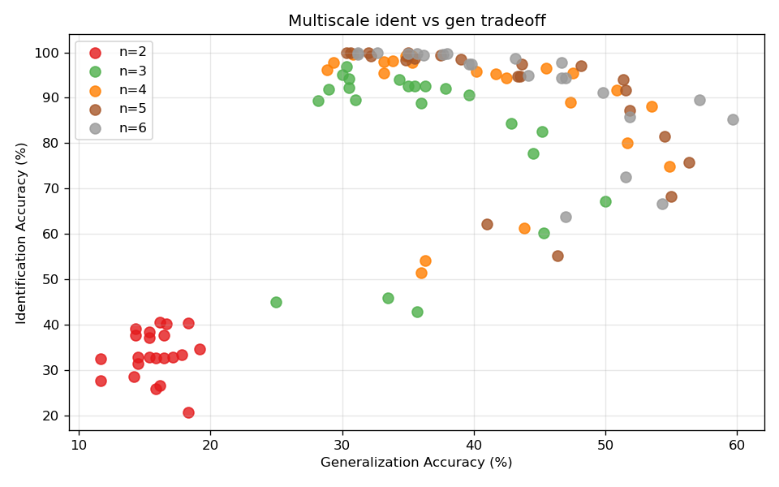
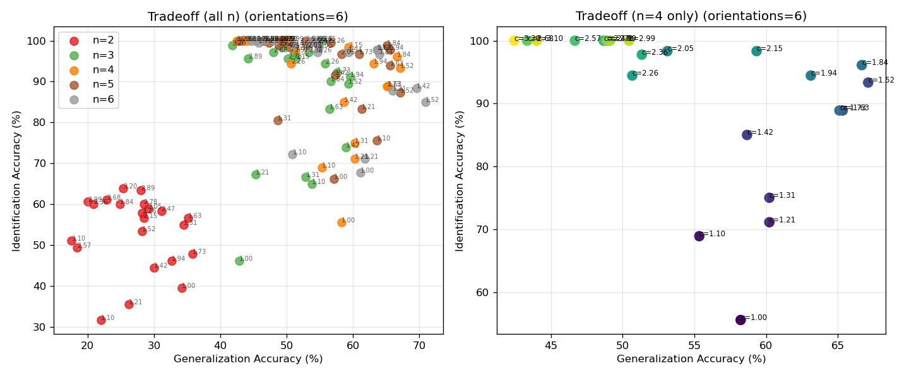
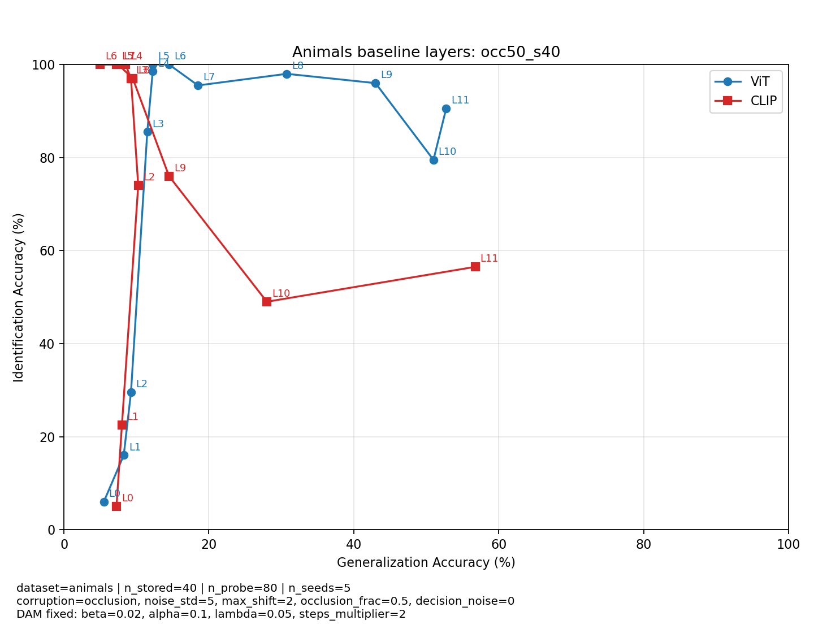
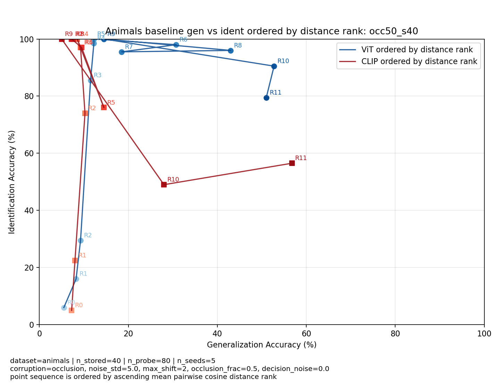

# Identification, Generalization, and Dense Associative Memory on Grid Codes and Naturalistic Vision

**Ahmed Al Sunbati**  
Neukom Scholar project handoff report  
Dartmouth College, June 2026

---

## Introduction

The starting question for this term was whether we could replicate a meaninguflly tradeoff between **identification** and **generalization** in vision systems coupled with DAM. Identification means: store a pattern, cue with a noisy version of the same pattern, and ask whether retrieval lands on the correct stored item. Generalization means: cue with a novel pattern and ask whether retrieval lands on the stored item that best matches it under some similarity rule.

I built two parallel tracks. The **grid track**, which was finished last term and optimized over the start of the spring to reduce runtime to under 5 mins per experiment, uses a synthetic 2D spatial code (inspired by grid cells) where the ident/gen tradeoff is real and easy to measure. The **vision track** uses pretrained image models (ViT, CLIP, ConvNeXt) on colored squares and on real Peterson images with human similarity ratings. Everything needed to rerun or reload results lives in the `handoff/` folder: two notebooks, CLI scripts, bundled data, and precomputed outputs under `results/`.

---

## 1. Core memory model: Dense Associative Memory

Both tracks share the same memory module, implemented in `core/DAM.py` as `DenseAssociativeMemory`.

### 1.1 Identification and generalization

> **Identification:** retrieve the stored pattern from a noisy encoding of the same point.  
> **Generalization:** retrieve the nearest stored pattern from a novel test point.

On the grid, "novel" means a fresh draw from the 2D input space. On vision, identification probes are corrupted copies of stored images; generalization probes are held-out images whose correct target is the stored image with highest human similarity (naturalistic) or highest task similarity (synthetic).

### 1.2 Energy and retrieval

Classical Hopfield networks use a quadratic energy in the overlap between state and stored patterns. Dense Associative Memory raises that overlap to order \(n > 2\) inside a rectified polynomial, which increases effective capacity. The energy for state vector \(\mathbf{s}\) and stored patterns \(\mathbf{p}_\mu\) is:

$$
E(\mathbf{s}) = -\sum_{\mu} F(\mathbf{p}_\mu \cdot \mathbf{s}) + \frac{\lambda}{2}\|\mathbf{s}\|^2, \qquad F(x) = [\max(0, x)]^n
$$

Retrieval starts from a noisy cue and runs asynchronous neuron updates. Each step moves one coordinate of \(\mathbf{s}\) toward a value that lowers the energy, using inverse temperature \(\beta\), relaxation rate \(\alpha\), and optional L2 regularization \(\lambda\). The network settles on whichever stored pattern has the strongest overlap with the final state.

For large sweeps I used the **Numba** backend (`retrieve_differential`) because the pure NumPy loop is too slow when you are crossing thousands of \((c, n, K)\) combinations.

---

## 2. Grid encoder and synthetic spatial benchmark

The grid track maps 2D coordinates into high-dimensional patterns before they enter DAM. `core/Encoder.py` implements `GridEncoder`, modeled after entorhinal grid cells.

### 2.1 Encoding

Each module \(m\) runs at spatial frequency proportional to `base_freq · c^m`, where \(c\) is the **scale factor** swept in the multiscale experiment. Within a module there are several orientation vectors \(\mathbf{k}_o\) in the plane and several phase-shifted grid cells. A 2D position \(\mathbf{x}\) is projected onto each grid:

$$
\phi_{m,o,p}(\mathbf{x}) = 2\pi f_m (\mathbf{x} \cdot \mathbf{k}_o) + \psi_{m,o,p}
$$

The encoded vector stacks \(\cos\phi\) and \(\sin\phi\) over all modules, orientations, and cells. Nearby locations get similar codes; far apart locations diverge. That gives DAM a smooth spatial memory substrate where we control geometry directly.

Default encoder settings in the notebook (4 modules, 3 orientations, 4 cells per orientation, `base_freq = 0.5`) match `lib/grid_defaults.py`.

---

## 3. Notebook: `GridDAM.ipynb`

### 3.1 Setup

The setup cell bootstraps paths from `handoff/lib/paths.py` and sets:

| Flag | Default | Meaning |
|------|---------|---------|
| `QUICK_MODE` | `False` | Smaller parameter grids for smoke tests |
| `LOAD_EXISTING` | `False` | Skip multiscale sweep if `results/grid/multiscale/ident_results.json` already exists |
| `OUTPUT_DIR` | `results/grid` | All grid outputs |

### 3.2 Structure preservation

Before any DAM sweep, the notebook checks that **encoded** distances still correlate with **2D** distances as \(c\) changes. If the code stops preserving geometry, ident/gen numbers are hard to interpret.

> Before running DAM sweeps, check that encoded distances still correlate with 2D distances as `c` changes.

### 3.3 Multiscale ident/gen sweep

The pipeline, quoted from the notebook:

> 1. **Encoder:** build a multiscale grid code with `n_modules` modules. Module `m` uses frequency `base_freq * c^m`, where `c` is the scale factor.  
> 2. **Memory:** store `K` encoded 2D points in a Dense Associative Memory. Vary the energy order `n` of the DAM.  
> 3. **Identification trials:** cue with noisy encodings of stored points.  
> 4. **Generalization trials:** cue with encodings of novel test points.  
> 5. **Sweep** over scale factor `c`, DAM order `n`, and number stored `K`. Plot identification vs generalization.

**Main finding:** generalization peaks near scale factor \(c \approx \sqrt{e} \approx 1.65\) while identification keeps improving at larger \(c\).



Outputs: `ident_results.json`, `gen_results.json`, `config.json`, and the tradeoff figure above.

### 3.4 Encoder sensitivity sweeps

This part varies **one encoder parameter at a time** (orientations, base frequency, module count, cells per orientation, or 2D sampling distribution) and tracks the gen-optimal scale factor \(c^*\) at fixed DAM order \(n = 4\).

> Change one encoder parameter at a time and track the gen-optimal scale factor `c` at `n=4`.

Each experiment writes JSON summaries and tradeoff PNGs under `results/grid/breakit/{experiment}/`.



---

## 4. Notebook: `VisionExperiments.ipynb`

### 4.1 Pipeline overview

> 1. Synthetic baseline on colored squares  
> 2. Multi-model comparison on the synthetic task  
> 3. Naturalistic baseline on real images with human similarity  
> 4. Dense Associative Memory on the naturalistic benchmark  
> 5. ViT vs CLIP on the Animals dataset: **layer-index** and **§distance-rank**

**Notebook flags:**

| Flag | Default | Meaning |
|------|---------|---------|
| `RUN_EXPERIMENTS` | `False` | Reload bundled JSON/PNG from `results/` |
| `RUN_EXPERIMENTS` | `True` | Regenerate into the same paths (slow on CPU) |
| `QUICK_MODE` | use with live runs | Smaller grids: synthetic caps; DAM quick = animals only, 1 stage-A config |
| `QUICK_MODE=False` (DAM live) | — | All three categories, 6 stage-A configs, stage B skipped, 1 seed, storage 40, ViT+CLIP |

### 4.2 Identification corruption protocol

Tracks 1–4 (synthetic baseline, model comparison, naturalistic baseline, naturalistic DAM) share a **stacked** identification protocol:

| Component | Setting |
|-----------|---------|
| Pixels | noise (std = 5) + shift ($\leq$ 2 px) + 50% occlusion |
| Retrieval scores | decision noise std = 0.01 on ident trials only |

### 4.3 Stage 1: Synthetic baseline

Colored squares at random positions; layerwise ViT features; cosine retrieval. Produces a line plot of identification vs generalization accuracy across transformer layers. Early debugging found that z-score normalization on tiny synthetic batches broke ident sanity checks; switching to **L2-only** normalization fixed that.

### 4.4 Stage 2: Model comparison (color vs location)

What if only color or only location varies? Three task modes are swept per backbone:

- `mixed_color_position` (both vary)
- `color_only` (square fixed position, color jitter)
- `position_only` (fixed color, position varies)

Backbones in the bundled summary: ViT, CLIP ViT, ConvNeXt. The notebook plots best-generalization, best-identification, and best-margin configs per model in ident/gen space.

> Synthetic model-comparison summary from `results/vision/model_comparison/`. Each backbone contributes three highlighted configs: best generalization, best identification, and best margin.

### 4.5 Stage 3: Naturalistic baseline

Peterson dataset: real photos plus a human similarity matrix per category (fruits, vegetables, animals). Generalization accuracy = percent of probes where retrieval picks the stored image with **highest human-rated similarity**. Vegetables uses `required_exemplars = 3` internally so leave-one-exemplar-out folds stay balanced.

> Real-image retrieval with human similarity for generalization. Identification probes use stacked `noise_shift_occlusion` plus decision noise.

### 4.6 Stage 4: Naturalistic DAM (ViT vs CLIP)

Same task definitions as baseline, but features pass through DAM with a small config search.

The notebook bar chart reads `vit_vs_clip_head_to_head.json` and plots **gen accuracy delta** (DAM minus baseline) for matched ViT vs CLIP branches. There are **seven** branch pairs (category × pooling × `anchor_kind`, where `anchor_kind` is `retrieval` or `alignment`), so labels like `animals-mean_tokens` can appear twice when retrieval and alignment anchors differ.

> Gen accuracy delta = DAM minus baseline on the human-similarity generalization task (% of probes where retrieval picks the human-rated best stored match; positive = DAM helps).

### 4.7 Stage 5: ViT vs CLIP on Animals dataset

Two views of the same metrics on the animals category only:

**layer-index:** points connected in transformer layer order; labels `L0`…`L11`. Reload from `results/image_transformers/{setting}/`.

**distance-rank:** same axes, but points ordered by ascending mean pairwise cosine distance among stored features; labels `R0`…`R11`. Reload from `results/image_transformers_similarity_ordered_fixed/{setting}/`.

Six settings: `easy_s40`, `easy_s80`, `occ50_s40`, `occ50_s80`, `occ50_dnoise001_s40`, `occ50_dnoise001_s80`. Each folder has five PNGs: baseline plus DAM orders \(n = 2, 4, 6, 8\).





> Same axes as §5A, but point sequence follows **ascending mean pairwise cosine distance** (stored-feature geometry).

Thereordering is **visualization only**; it does not change the underlying metrics (see `results/image_transformers_similarity_ordered_fixed/overall_insights.md`). The reordering is just a different view of the same layerwise represenation geometry.

---

## 5. Results summary

### 5.1 Grid (multiscale)

On the grid task the ident/gen tradeoff is clear: generalization peaks near \(c \approx 1.65\), identification rises with larger \(c\). Break-it sweeps show how encoder parameters shift that optimum.

### 5.2 Vision: synthetic

Synthetic colored squares were useful for debugging.

- After the L2-only preprocessing fix, sanity checks passed.
- No convincing ident/gen tradeoff appeared on synthetic features.
- Color was easy; position was weaker.
- Swapping backbone (ViT, DeiT, ConvNeXt, ResNet, CLIP) did not fix it.
- Splitting **color-only** vs **position-only** tasks showed color dominating; position alone was especially weak.

So the synthetic distribution (colored squares at random locations) is probably too unusual relative to ImageNet pretraining, which matches your intution from email.

### 5.3 Vision: naturalistic baseline

Moving to Peterson images changed everything. Across fruits, vegetables, and animals:

- **Late layers** gave the best retrieval accuracy.
- **Mid layers** gave the best alignment with human similarity (Spearman correlation between model RDM and human RDM).

Best baseline generalization (ViT, bundled notebook regen, stacked ident protocol):

| Category | Best ViT gen accuracy |
|----------|----------------------|
| Fruits | 55.0% |
| Vegetables | 53.8% |
| Animals | 65.0% |

(CLIP image-tower retrieval peaks slightly higher on fruits at 57.5%; see 5.4.)

Best human-alignment Spearman (ViT mid-layer rows, not layer 11):

| Category | human_rdm_spearman |
|----------|------------------|
| Fruits | 0.379 |
| Vegetables | 0.462 |
| Animals | 0.423 |

Retrieval and alignment **do not peak at the same layer**.
### 5.4 CLIP as encoder (image only)

CLIP (ViT image tower, no text) boosted alignment a lot:

| Category | Best CLIP alignment |
|----------|---------------------|
| Fruits | 0.580 |
| Vegetables | 0.494 |
| Animals | 0.550 |

But ViT still owned the strongest top retrieval rows. **ViT for retrieval, CLIP for alignment.**

### 5.5 DAM on naturalistic features

After baseline retrieval on real Peterson images, DAM was applied on top of those features. This section summarizes whether that heled retrieval in generalization and whether ViT or CLIP was the better backbone.

DAM helped unevenly. Numbers below come from the **capped notebook regen** in `results/vision/naturalistic_dam/`. A separate full CLI sweep can explore larger config grids.

| Category | DAM story (bundled regen) |
|----------|---------------------------|
| Fruits | 0 qualifying wins; raw gen deltas up to +7.5 pp (CLIP `mean_tokens` retrieval) but probe-RDM alignment drops |
| Vegetables | 0 qualifying wins; raw deltas up to +7.7 pp (ViT `mean_tokens` retrieval) with modest alignment lift |
| Animals | 6 qualifying wins; best clean branch 52.5% → 55.0% gen (+2.5 pp, ViT `cls` retrieval, layer 11) |

Head-to-head gen deltas (same capped run):

| Branch | ViT Δgen | CLIP Δgen |
|--------|----------|-----------|
| animals cls retrieval | +2.5 pp | +2.5 pp |
| animals mean_tokens retrieval | +2.5 pp | +1.2 pp |
| animals mean_tokens alignment | −1.2 pp | −1.3 pp |
| fruits mean_tokens retrieval | +2.5 pp | **+7.5 pp** |
| vegetables mean_tokens retrieval | **+7.7 pp** | +5.1 pp |

So animals shows the most **stable** DAM wins under the qualifying rule (improves generalization without breaking memory or geometry).

Matched ViT vs CLIP under DAM: **ViT wins on vegetables and animals retrieval branches**; **CLIP wins on fruits `mean_tokens` retrieval**.

### 5.6 Grid vs vision (comparison)

| | Grid track | Vision track |
|--|------------|--------------|
| Stimulus | Synthetic 2D points | Colored squares, then real photos |
| Features | GridEncoder | ViT / CLIP / ConvNeXt layers |
| Gen target | Nearest stored in 2D | Task similarity or human similarity |
| Ident/gen tradeoff? | **Yes** (multiscale sweep) | **No** on synthetic; different story on naturalistic |
| Main positive result | \(c \approx \sqrt{e}\) gen peak | Retrieval vs alignment split; DAM on animals |

---

## 6. Reproducibility

All handoff code, data, and bundled outputs sit under `handoff/`. Setup:

```bash
cd handoff
python -m venv .venv
source .venv/bin/activate
pip install -r requirements.txt
```

Verify the package:

```bash
pytest -q
python scripts/verify_artifacts.py
python scripts/bootstrap_standalone.py
```

**Notebooks to open** (kernel cwd = `handoff/` or `handoff/notebooks/`):

- `notebooks/GridDAM.ipynb`
- `notebooks/VisionExperiments.ipynb`

**Bundled results** live in `results/` with checksums in `results/MANIFEST.json`. With `RUN_EXPERIMENTS = False` (vision) or `LOAD_EXISTING = True` (grid multiscale), notebooks reload those files without rerunning sweeps.

**PDF export** (Pandoc + memoir + Tectonic):

```bash
bash latex_exports/compile_memo.sh
```

Output: `latex_exports/pdf/REPORT.pdf`.

---

## 7. Scripts reference

### 7.1 Grid scripts

| Script | Purpose & key arguments | Default output |
|--------|-------------------------|----------------|
| `run_grid_multiscale.py` | Part 4 multiscale sweep. `--quick`, `--scale-min`, `--scale-max`, `--n-values`, `--k-values`, encoder/DAM hyperparams | `results/grid/multiscale/` |
| `run_grid_breakit.py` | Part 4b sensitivity. `--experiment` (orientations, base_freq, modules, cells, distributions, all), `--quick` | `results/grid/breakit/` |

Example quick smoke:

```bash
cd handoff
source .venv/bin/activate
python scripts/run_grid_multiscale.py --quick
python scripts/run_grid_breakit.py --experiment orientations --quick
```

### 7.2 Vision scripts

| Script | Purpose & key arguments | Default output |
|--------|-------------------------|----------------|
| `run_vision_synthetic.py` | Synthetic baseline. `--task-mode` (mixed, color_only, position_only), `--quick`, `--device` | `results/vision/synthetic/` |
| `run_vision_model_comparison.py` | Multi-backbone synthetic sweep. `--models` (or quick ViT-only), `--device` | `results/vision/model_comparison/` |
| `run_vision_naturalistic_baseline.py` | Peterson baseline. `--category` (fruits, vegetables, animals), `--include-clip`, `--quick` | `results/vision/naturalistic/` |
| `run_vision_naturalistic_dam.py` | DAM on naturalistic features. `--category`, `--baseline-dir`, `--max-stage-a-configs`, `--quick` | `results/vision/naturalistic_dam/` |
| `run_vision_animals_graphs.py` | §5A graph regen. `--max-settings`, `--max-seeds`, `--max-layers`, `--quick` | `results/image_transformers/` |
| `run_vision_animals_similarity_ordered.py` | §5B step 1. Same caps as graphs script | `results/image_transformers_similarity_ordered/` |
| `run_vision_animals_similarity_ordered_fixed.py` | §5B step 2 reorder plots. `--input-dir`, `--output-dir` | `results/image_transformers_similarity_ordered_fixed/` |

Example vision smoke:

```bash
python scripts/run_vision_synthetic.py --quick
python scripts/run_vision_model_comparison.py --models vit_base_patch16_224
python scripts/run_vision_naturalistic_baseline.py --category fruits --quick
```

Full naturalistic DAM (slow):

```bash
python scripts/run_vision_naturalistic_baseline.py --category animals --include-clip
python scripts/run_vision_naturalistic_dam.py --category animals
```

---
